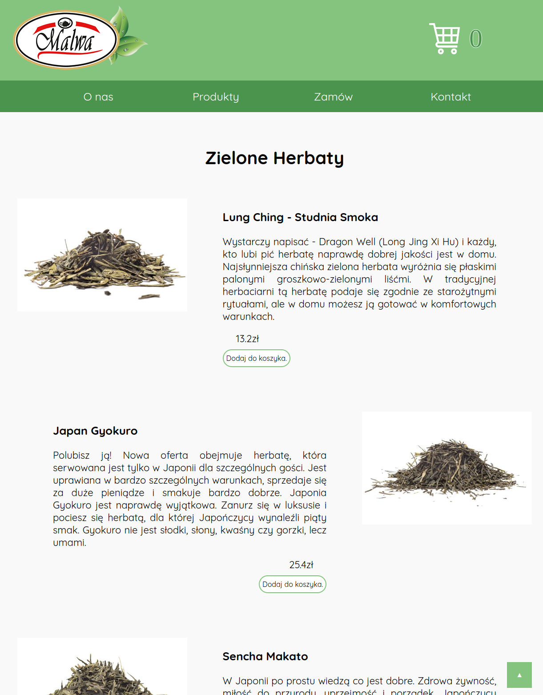
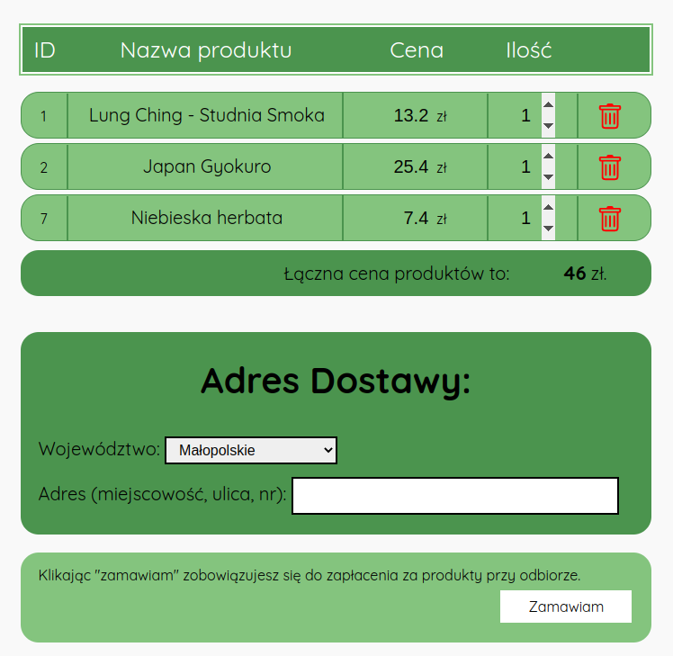
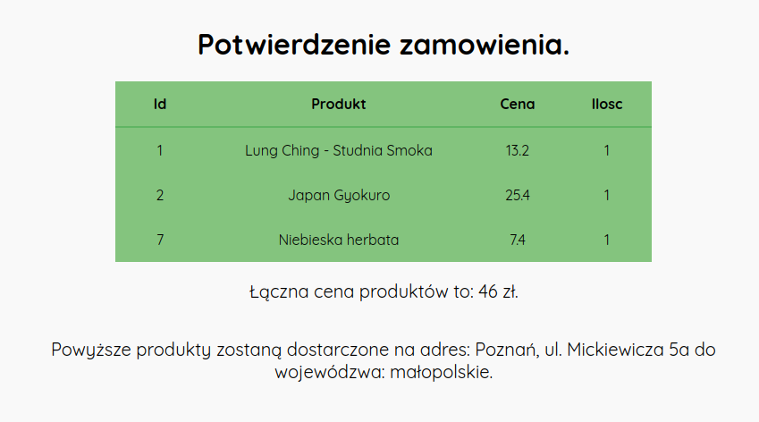

# Malwa Tea

This is a repository for the project of a fictional company's online store website. Company is called "Malwa Tea". I hosted this website on Amazon AWS, and you can click on [this link](http://ec2-52-87-229-246.compute-1.amazonaws.com/) to see what the website looks like. If you speak polish, you can also click on [this link](https://drive.google.com/file/d/1TIuaRz3wrAIUWZIIjwZIPpy4jEbDsXGx/view?usp=share_link) to watch a video that shows how to use the website. Video is in polish, because website is also in polish.  
This website was created as a school project in 2021, and I was responsible for all of the logical functioning of the website, such as writing the PHP and JavaScript code, creating the database and inputting content into it, and hosting the website online (creating an instance in AWS EC2, configuring Apache, PHP, security groups, etc.). The other team members were responsible for the styling (CSS) and content of the website.  
## Website functionality
After selecting "Products" from the main menu, a list of all of the company's products, i.e., all of the teas offered by the company, is displayed on the screen.
 
All information about the products, such as their names, descriptions, prices, and types (i.e., whether is s black tea, green tea, or another type) is stored in a SQL database. Each time the server renders the page, a list of all of the products is retrieved from the database. All of the product information, including their names, descriptions, prices, and types, is then inserted into the appropriate locations in the HTML files using PHP "echo" statements. This means that product information is stored in only one place, in the database, and there is no need to change the content of the PHP files after adding or removing a product from the database.  
After adding a few products to the shopping cart, you can select "Order" from the main menu to display a list of all the products in the cart.
 
The state of the shopping cart is saved in the session, so you can easily close the website, reopen it, and all of the products that were in the cart will still be there. You can click on a product in the cart to be redirected back to the product page, specifically to the description of the product you clicked on. When the quantity of a product in the cart is increased or a product is removed from the cart, the JavaScript code does two things. First, it recalculates the total price of all of the products and updates the total price displayed. Second, using AJAX technology, it sends a request to the server to remove the product from the cart or change the quantity of the product in the cart. This ensures that the state of the shopping cart is always stored in the session, and you can close and reopen the website, and everything in the cart will still be there.  
After entering a delivery address and clicking "Order", a confirmation of the order is displayed on the screen.

  
There are also two other tabs: "Contact" and "About us". Clicking on "Contact" displays a fictional contact for the company, and clicking on "About us" displays a fictional description of the company.